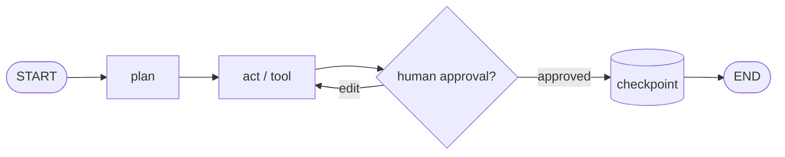

<div align="center">


[](https://www.python.org/)
[](https://opensource.org/licenses/MIT)
[](./pyproject.toml)
[](./tests/test_graph.py)
[](https://github.com/0xabhi13)

**Build powerful, long-running AI agents as flowcharts — stateful, crash-safe, human-approved.**

[Quickstart](#-30-second-quickstart) · [Durability](#2-durability--resume-after-crash) · [Human-in-the-loop](#3-human-in-the-loop) · [Examples](./examples/) · [API](#-api-map)

</div>

---

## How it runs

<svg width="100%" height="120" viewBox="0 0 720 120" xmlns="http://www.w3.org/2000/svg" role="img" aria-label="agent pipeline animation">
  <defs>
    <marker id="arrow" markerWidth="8" markerHeight="8" refX="7" refY="4" orient="auto">
      <path d="M0,0 L8,4 L0,8 z" fill="#58A6FF"/>
    </marker>
  </defs>
  <!-- track -->
  <line x1="60" y1="60" x2="660" y2="60" stroke="#30363d" stroke-width="3"/>
  <!-- moving pulse -->
  <circle r="7" fill="#58A6FF">
    <animateMotion dur="3s" repeatCount="indefinite" path="M60,60 L660,60"/>
  </circle>
  <!-- nodes -->
  <g font-family="monospace" font-size="12" text-anchor="middle">
    <rect x="20" y="35" width="90" height="50" rx="10" fill="#0d1117" stroke="#58A6FF" stroke-width="2">
      <animate attributeName="stroke-opacity" values="1;0.3;1" dur="2s" repeatCount="indefinite"/>
    </rect>
    <text x="65" y="63" fill="#fff">plan</text>
    <rect x="155" y="35" width="90" height="50" rx="10" fill="#0d1117" stroke="#3fb950" stroke-width="2">
      <animate attributeName="stroke-opacity" values="0.3;1;0.3" dur="2s" begin="0.5s" repeatCount="indefinite"/>
    </rect>
    <text x="200" y="63" fill="#fff">act / tool</text>
    <rect x="290" y="35" width="110" height="50" rx="10" fill="#0d1117" stroke="#d29922" stroke-width="2">
      <animate attributeName="stroke-opacity" values="1;0.3;1" dur="2s" begin="1s" repeatCount="indefinite"/>
    </rect>
    <text x="345" y="63" fill="#fff">human check</text>
    <rect x="445" y="35" width="110" height="50" rx="10" fill="#0d1117" stroke="#a371f7" stroke-width="2">
      <animate attributeName="stroke-opacity" values="0.3;1;0.3" dur="2s" begin="1.5s" repeatCount="indefinite"/>
    </rect>
    <text x="500" y="63" fill="#fff">checkpoint</text>
    <rect x="600" y="35" width="90" height="50" rx="10" fill="#0d1117" stroke="#58A6FF" stroke-width="2"/>
    <text x="645" y="63" fill="#fff">done</text>
  </g>
</svg>



> Every node execution checkpoints. Kill the process anywhere — resume from the same `thread_id`.

---

## 30-second quickstart

```bash
pip install 0xAgents
# local dev:
pip install -e .
```

```python
from agentgraph import StateGraph, END

g = StateGraph()
g.add_node("fetch", lambda s: {"data": "raw"})
g.add_node("analyze", lambda s: {"report": f"analysis-of-{s['data']}"})
g.add_edge("fetch", "analyze")
g.add_edge("analyze", END)
g.set_entry_point("fetch")

app = g.compile()
print(app.invoke({"job": "demo"}, config={"thread_id": "t1"}))
# {'job': 'demo', 'data': 'raw', 'report': 'analysis-of-raw'}
```

<details>
<summary><b>1. Stateful memory — agents that remember</b></summary>

<br/>

State is a dict merged after every step. Per-key reducers control the merge:

```python
import operator

g = StateGraph(channels={"messages": operator.add})

def plan(state):
    return {"messages": ["plan: break task down"]}

def act(state):
    return {"messages": ["act: tools executed"]}
```

Result: `["user: solve it", "plan: ...", "act: ..."]` — full context preserved across steps.
History is queryable: `app.get_state_history(cfg)`.

</details>

<details>
<summary><b>2. Durability — resume after crash</b></summary>

<br/>

```python
from agentgraph import JsonFileCheckpointer

app = g.compile(checkpointer=JsonFileCheckpointer("./_checkpoints"))
app.invoke({...}, config={"thread_id": "etl-job-1"})
# process dies here — no problem
app.invoke(None, config={"thread_id": "etl-job-1"})  # resumes, no step re-runs
```

- Checkpoint after **every** node (atomic JSON write, one file per thread).
- Failure in one node never loses prior steps; per-node `retry` supported:
  `g.add_node("flaky", fn, retry=3, retry_delay=0.5)`.
- Try it: `python examples/durable_resume.py` → run twice → second run finishes.

</details>

<details>
<summary><b>3. Human-in-the-loop — review, approve, edit</b></summary>

<br/>

```python
app = g.compile(interrupt_before=["send_email"])

paused = app.invoke({...}, config=cfg)
# {'__interrupt__': [{'node': 'send_email', 'reason': '...', 'when': 'before'}], ...state}

app.get_state(cfg)                                             # review
app.update_state(cfg, {"approved": True, "draft": "edited"})   # approve-with-edits
app.invoke(None, config=cfg)                                   # resume
```

Three pause modes:

| Mode | How | Use for |
|------|-----|---------|
| `interrupt_before=["tool"]` | pause before node | approve risky tool calls |
| `interrupt_after=["draft"]` | pause after node | review outputs |
| `raise NodeInterrupt("...")` | pause from inside node | dynamic gating on state |

Try it: `python examples/human_in_loop.py`

</details>

<details>
<summary><b>4. Observable by default</b></summary>

<br/>

```python
from agentgraph import ConsoleTracer

app = g.compile(tracers=[ConsoleTracer()])
for event in app.stream({...}, config={"thread_id": "t1"}):
    print(event["node"], event["step"])
```

- `node_start / node_end / node_error / checkpoint / interrupt / graph_end` events.
- Implement `Tracer.on_event()` to ship to logging / LangSmith / OpenTelemetry.
- `stream()` yields per-step `{node, update, state, step}` for live UIs.

</details>

---

## API map

| Area | Import | Key symbols |
|------|--------|-------------|
| Graph | `agentgraph` | `StateGraph`, `CompiledGraph`, `StateSnapshot`, `START`, `END` |
| Durability | `agentgraph` | `BaseCheckpointer`, `InMemoryCheckpointer`, `JsonFileCheckpointer` |
| HITL | `agentgraph` | `NodeInterrupt`, `HumanInterrupt` |
| Observability | `agentgraph` | `Tracer`, `ConsoleTracer`, `CallbackTracer`, `NullTracer`, `GraphEvent` |

Core calls: `compile()` → `invoke()` / `stream()` → `get_state()` → `update_state()` → `invoke(None, cfg)` → `get_state_history()`.

---

## Project layout

```
agentgraph/          library: graph.py, checkpoint.py, interrupts.py, observability.py
tests/               pytest suite: graphs, reducers, branching, HITL, crash-resume, retries
examples/            basic.py · durable_resume.py · human_in_loop.py
pyproject.toml       zero-dependency package, Python >= 3.9
```

Run tests: `python -m pytest tests -q` (9 passed).

---

## When to use this

- Multi-step agents that must **remember** prior tool outputs.
- Jobs that run **minutes to days** and must survive restarts.
- Workflows where a **human must approve** before side effects.
- Teams that want a **low-level, transparent** graph engine — no hidden magic, every transition explicit and traceable.

---

## Roadmap

- [ ] Async nodes + parallel fan-out/fan-in
- [ ] SQLite/Postgres checkpointer
- [ ] Tool-node helpers (OpenAI/Anthropic function-calling adapters)
- [ ] OpenTelemetry tracer + LangSmith exporter

Contributions welcome — open an issue or PR.

---

<div align="center">

### Created and maintained by [0xabhi13](https://github.com/0xabhi13)

If you use this library, please credit the author and link back to
[github.com/0xabhi13](https://github.com/0xabhi13).


MIT License · Python ≥ 3.9 · Zero dependencies

</div>
