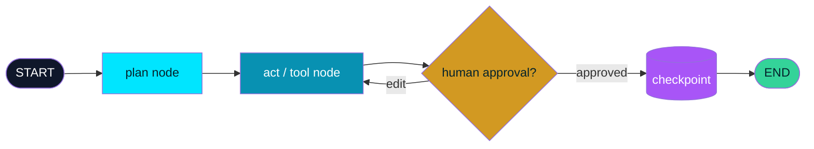

<div align="center">


<br/>

<a href="https://github.com/0xabhi13/0xAgents">
  
</a>

<br/><br/>

[](https://www.python.org/)
[](./pyproject.toml)
[](./tests/test_graph.py)
[](./LICENSE)


<br/>

**Created by Abhishek Jadhav — [@0xabhi13](https://github.com/0xabhi13)**

</div>


<div align="center">

### Table of Contents

[About](#-what-is-0xagents) • [Features](#-features) • [How It Works](#-how-it-works) • [Install](#-installation) • [Usage](#️-usage) • [Structure](#️-project-structure) • [API](#-api-map) • [Roadmap](#️-future-roadmap) • [License](#-license)

</div>


## What is 0xAgents?

**0xAgents** builds powerful, long-running AI agents as **flowcharts** — each node is a step or a tool call, edges route the flow. Agents are **stateful** (they remember), **durable** (they survive crashes), and **human-in-the-loop** (they pause for review before acting).

<div align="center">

```text
> Initializing 0xAgents...
> Graph compiled              ✓  3 nodes • 3 edges • entry=fetch
> invoke thread=etl-job-1     ✓  fetch → analyze
> checkpoint saved            ✓  step 2 • JsonFileCheckpointer
> interrupt_after analyze     ⏸  awaiting human review
> human approved              ✓  report reviewed + edited
> resumed                     ✓  publish → END
> 0xAgents done. 3 steps, 0 lost.
```

</div>

<br/>

<div align="center">

</div>

<svg width="100%" height="120" viewBox="0 0 720 120" xmlns="http://www.w3.org/2000/svg" role="img" aria-label="agent pipeline animation">
  <defs>
    <marker id="arrow" markerWidth="8" markerHeight="8" refX="7" refY="4" orient="auto">
      <path d="M0,0 L8,4 L0,8 z" fill="#58A6FF"/>
    </marker>
  </defs>
  <line x1="60" y1="60" x2="660" y2="60" stroke="#30363d" stroke-width="3"/>
  <circle r="7" fill="#58A6FF">
    <animateMotion dur="3s" repeatCount="indefinite" path="M60,60 L660,60"/>
  </circle>
  <g font-family="monospace" font-size="12" text-anchor="middle">
    <rect x="20" y="35" width="90" height="50" rx="10" fill="#0d1117" stroke="#58A6FF" stroke-width="2">
      <animate attributeName="stroke-opacity" values="1;0.3;1" dur="2s" repeatCount="indefinite"/>
    </rect>
    <text x="65" y="63" fill="#fff">plan</text>
    <rect x="155" y="35" width="90" height="50" rx="10" fill="#0d1117" stroke="#3fb950" stroke-width="2">
      <animate attributeName="stroke-opacity" values="0.3;1;0.3" dur="2s" begin="0.5s" repeatCount="indefinite"/>
    </rect>
    <text x="200" y="63" fill="#fff">act / tool</text>
    <rect x="290" y="35" width="110" height="50" rx="10" fill="#0d1117" stroke="#d29922" stroke-width="2">
      <animate attributeName="stroke-opacity" values="1;0.3;1" dur="2s" begin="1s" repeatCount="indefinite"/>
    </rect>
    <text x="345" y="63" fill="#fff">human check</text>
    <rect x="445" y="35" width="110" height="50" rx="10" fill="#0d1117" stroke="#a371f7" stroke-width="2">
      <animate attributeName="stroke-opacity" values="0.3;1;0.3" dur="2s" begin="1.5s" repeatCount="indefinite"/>
    </rect>
    <text x="500" y="63" fill="#fff">checkpoint</text>
    <rect x="600" y="35" width="90" height="50" rx="10" fill="#0d1117" stroke="#58A6FF" stroke-width="2"/>
    <text x="645" y="63" fill="#fff">done</text>
  </g>
</svg>

## Features

<table>
<tr>
<td width="33%" align="center">

### Graph Engine
Nodes are plain `fn(state) -> dict`. Static edges + conditional routing, `START` / `END`, explicit and low-level — no hidden magic.

</td>
<td width="33%" align="center">

### Stateful Memory
Dict state merged every step. Per-key reducers (`channels`) append instead of overwrite — e.g. `{"messages": operator.add}`.

</td>
<td width="33%" align="center">

### Durable Execution
Checkpoint after **every** node. `JsonFileCheckpointer` survives process kills — resume with the same `thread_id`, zero steps lost.

</td>
</tr>
<tr>
<td width="33%" align="center">

### Human-in-the-Loop
`interrupt_before` / `interrupt_after` / `raise NodeInterrupt`. Review with `get_state`, approve-with-edits via `update_state`, resume with `invoke(None, cfg)`.

</td>
<td width="33%" align="center">

### Observable
`node_start / node_end / node_error / checkpoint / interrupt / graph_end` events. Pluggable `Tracer`s, live `stream()`, full state history per thread.

</td>
<td width="33%" align="center">

### Robust
Per-node `retry` + `retry_delay`, recursion guard against infinite loops, tracers that can never break execution. Zero dependencies, Python 3.9+.

</td>
</tr>
</table>

## How It Works



Each `invoke()` loads the thread checkpoint, runs the next nodes in order (merging state + checkpointing after each), and stops at `END` — or pauses with `__interrupt__` when a human must step in. Resume any time with `invoke(None, config)`.

## Installation

<details open>
<summary><b>Click to expand setup steps</b></summary>

<br/>

**1. Clone the repo**

```bash
git clone https://github.com/0xabhi13/0xAgents.git
cd 0xAgents
```

**2. Create a virtual environment**

<table>
<tr><th>Windows</th><th>macOS / Linux</th></tr>
<tr>
<td>

```bash
python -m venv venv
venv\Scripts\activate
```

</td>
<td>

```bash
python3 -m venv venv
source venv/bin/activate
```

</td>
</tr>
</table>

**3. Install (zero dependencies)**

```bash
pip install -e .
```

**4. Run tests + examples**

```bash
python -m pytest tests -q
python examples/basic.py
python examples/human_in_loop.py
python examples/durable_resume.py
```

> No API key needed. Everything runs locally.

</details>

## Usage

```text
1. Define → StateGraph + add_node / add_edge / add_conditional_edges
2. Compile → g.compile(checkpointer=..., interrupt_before=... , tracers=...)
3. Run → app.invoke(input, config={"thread_id": "job-1"})
4. Pause → returns {"__interrupt__": [...]} when human review is needed
5. Review → app.get_state(cfg) → app.update_state(cfg, {...edits, approved: True})
6. Resume → app.invoke(None, config=cfg) → runs to END
```

```python
from agentgraph import StateGraph, END

g = StateGraph()
g.add_node("fetch", lambda s: {"data": "raw"})
g.add_node("analyze", lambda s: {"report": f"analysis-of-{s['data']}"})
g.add_edge("fetch", "analyze")
g.add_edge("analyze", END)
g.set_entry_point("fetch")

app = g.compile()
print(app.invoke({"job": "demo"}, config={"thread_id": "t1"}))
```

```python
# Human gate on a risky tool
app = g.compile(interrupt_before=["send_email"])
paused = app.invoke({...}, config=cfg)          # pauses, returns __interrupt__
app.update_state(cfg, {"approved": True})       # human approves
app.invoke(None, config=cfg)                    # resumes to END
```

```python
# Crash-safe long job
from agentgraph import JsonFileCheckpointer
app = g.compile(checkpointer=JsonFileCheckpointer("./_checkpoints"))
app.invoke({...}, config={"thread_id": "etl-1"})   # kill process anytime
app.invoke(None, config={"thread_id": "etl-1"})    # resumes, no re-runs
```

## Project Structure

```text
0xAgents/
│
├── agentgraph/
│   ├── __init__.py           # public exports (StateGraph, checkpointers, tracers)
│   ├── graph.py              # StateGraph builder + CompiledGraph engine
│   ├── checkpoint.py         # BaseCheckpointer, InMemory + JsonFile backends
│   ├── interrupts.py         # NodeInterrupt, HumanInterrupt
│   └── observability.py      # Tracer, ConsoleTracer, CallbackTracer, GraphEvent
├── tests/
│   └── test_graph.py         # pytest — graphs, reducers, HITL, crash-resume, retries
├── examples/
│   ├── basic.py              # plan → act → summarize
│   ├── durable_resume.py     # kill-and-resume demo
│   └── human_in_loop.py      # review → approve-with-edits → resume
├── pyproject.toml            # zero-dependency package, Python >= 3.9
├── LICENSE                   # MIT
└── README.md
```

## API Map

<div align="center">

| Area | Import | Key symbols |
|:---|:---|:---|
| Graph | `agentgraph` | `StateGraph`, `CompiledGraph`, `StateSnapshot`, `START`, `END` |
| Durability | `agentgraph` | `BaseCheckpointer`, `InMemoryCheckpointer`, `JsonFileCheckpointer` |
| HITL | `agentgraph` | `NodeInterrupt`, `HumanInterrupt` |
| Observability | `agentgraph` | `Tracer`, `ConsoleTracer`, `CallbackTracer`, `NullTracer`, `GraphEvent` |

*Core calls: `compile()` → `invoke()` / `stream()` → `get_state()` → `update_state()` → `invoke(None, cfg)` → `get_state_history()`.*

</div>

## Future Roadmap

- [ ] Async nodes + parallel fan-out / fan-in
- [ ] SQLite / Postgres checkpointer
- [ ] Tool-node helpers (OpenAI / Anthropic function-calling adapters)
- [ ] OpenTelemetry tracer + LangSmith exporter

<div align="center">

</div>

## Author

<div align="center">

### Abhishek Jadhav

Creator of **0xAgents** & **0xPDFForge** — building durable AI systems and creative Python projects.

[](https://github.com/0xabhi13)
[](https://linkedin.com/in/0xabhi13)

</div>

## License

Released under the [MIT License](LICENSE).

<div align="center">


**Built with durable graphs and human approvals.**

</div>
